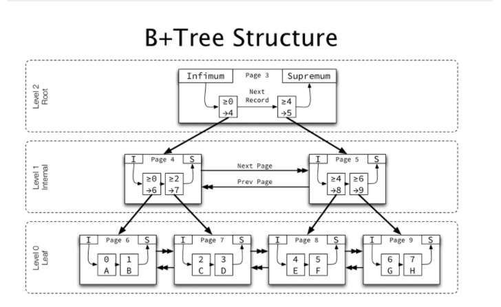

### 一条sql的执行会发生什么？

- http://wearygods.online/MySQL-45  来自于一个哥们的整理,优秀
- 首先与mysql建立连接
- 语法分析,对sql语句进行语法分析,校验语句是否是正确的
- mysql对sql进行一定的优化,选择最优的索引
- mysql执行器
    - 首先写入undo-log,记录下执行语句的回滚日志
    - 然后判断查找的数据是否存在于内存中
        - 内存中
            - 判断是普通索引还是唯一索引
            - 普通索引
                - 直接进行更新
            - 唯一索引
                - 判断唯一索引是否冲突,然后进行更新
        - 磁盘中
            - 普通索引
                - 变更到changeBuffer
            - 唯一索引
                - 校验磁盘中数据是否唯一,无冲突则进行更新
    - 然后写redo-log (记录事务对数据页进行了哪些修改,包括两部分 redo-log buffer 和 redo-log file)
    - 此时事务处于prepare阶段
    - 然后写bin-log
    - 成功之后事务处于 commit阶段。
    - redo-log 刷磁盘
    - bin-log 刷磁盘

### Mysql为什么要使用二阶段提交机制？

- 描述一下两阶段提交：
    - 写入redo-log,事务处于prepare阶段
    - 写入bin-log
    - 修改redo-log状态为commit阶段
    - ps:redo-log的提交分为prepare和commit阶段,从而称为两阶段提交。
       
- **主要还是为了保证事务的崩溃恢复以及数据的一致性**
- 反证法来看的话
    - 如果redo-log写完就提交事务,那么写bin-log的时候mysql宕机了,会导致在从库同步的情况下就会缺少数据。
    - 如果先写完bin-log,然后mysql宕机,此时redo-log是没有数据的,所以崩溃恢复的时候事务无效。如果用bin-log恢复的话,就会多一个事务出来。
    - 结论:**如果不采用两阶段提交的话,会导致数据库本身的数据和用日志恢复出来的不同**

### 数据库的索引有哪几种？

- 数据结构分类:
    - B+TREE:B+树为多叉树,并且索引节点只存储索引值,叶子节点存储相关数据,叶子节点为双向链表并且有序,适合范围查找,查询时磁盘IO次数低,每个节点都是一个数据页,一页16KB
    - HASH:只适合等值查找

- 索引种类:
    - 聚簇索引: 叶子节点存储整行的数据
    - 非聚簇索引:叶子节点存储的数据是主键索引的值

- 索引字段特性:
    - 主键索引:一张数据表只能有一个主键索引,不能为空
    - 唯一索引:该字段值在数据表中是唯一的,允许为空,表中可以存在多个唯一索引
    - 普通索引:普通字段上的索引
    - 联合索引:多列字段组合在一起的索引
    - 前缀索引:对某列字段的前几个字符建立索引。

### 联合索引和单列索引有哪些区别？

- 联合索引:联合索引是针对多列字段建立的索引,遵循最左前缀匹配原则,就是查询的时候最左面的字段一定要进行匹配(遇到范围查询的时候会停止),才会走联合索引
- 单列索引:单个字段的索引
- 结论:联合索引所占的空间会比单列索引占用空间低,另外索引建立的越多,更新数据的时候就会越慢,因为要维护当前数据在索引的位置。

### 索引失效的情况有哪些？

- 对索引列使用函数 squirrel(hobby)
- 使用不等于等表达式  !=
- 字段类型出现了隐式转换 varchar int
- **联合索引,未使用前缀匹配**
- or语句前后列有一个没有索引的也不会走索引

### sql优化？

- 索引层面:
    - 通过explain关键字来查看sql的执行计划,执行计划中有一列为type的字段,可以看到当前语句是否使用了索引,如果为all证明,未走索引,然后为需要加索引的字段增加索引。
    - 只返回必要的列,无用的列尽量不要返回。
    - 避免在查询条件处使用函数表达式等,使得索引失效。
- 切分大查询:
    - 可以将一个数据量特别大查询语句,切分成几块,避免给数据库特别大的压力

### Mysql分页优化？

- 默认的limit分页,在limit一个很大的下标的时候,查询速度会变得及其慢,因为他也将下标之前的那些数据查询了出来,导致效率变慢
- 可以通过子查询进行一个优化,子查询里查出ID作为外层查询的条件,这样的话用ID就能过滤掉很多无用的数据了。

### mysql有哪些锁？

- 全局锁:
    - 对整个数据库进行加锁,让整个数据库处于读的状态,不能写,用于做逻辑备份等操作。
        - flush table with read lock :该命令让数据只处于只读的状态
        - 利用innodb的事务隔离性(可重复读),利用官方提供的逻辑备份工具mysqldump进行备份的时候,
          设置-single-transaction,这样导数据的时候就会开启一个事务,利用mysql的mvcc机制保证在事务执行过程中,读取到的数据都是一致的。
        - set global readonly=true,让全库变为只读的状态
- 表锁
    - 表锁: lock table read/write,对当前表进行加读锁或者写锁。 |读锁的时候,所有的线程只能读,不能写。||写锁的时候,只有当前线程能够进行写,其他的线程都不能进行操作。
    - 意向共享锁:
        - 一个事务想对某行数据加一个行级别的S锁,在申请S锁之前会主动申请表的IS(意向共享锁)。
    - 意向排它锁:
        - 一个事务想要对某行数据申请一个行级别的X锁,在申请X(排他锁)之前会主动申请表的IS(意向排他锁)。
    - 结论: 意向锁之间都是兼容的。意向锁只有和表级别的共享锁和排他锁有不兼容的情况。因为我们如果要对某个表申请加表级别的共享锁(S)或者排他锁(X)
      ,我们首先要判断是否有表级别的排他锁,如果没有的话,我们还要一行行的判断是否有些行使用了排他锁,那样效率就太慢了。所以就引入了意向锁。就能够直接的判断能否对表进行加锁。
- 行锁(记录锁)
    - S共享锁: `select * from squirrel lock in share mode` 当前行只能被读取,不能被修改,读锁是共享的.
    - X排他锁: `update squirrel set hobby='看书' where id =1'` 当前行只能被当前事务修改,其他事务不可以进行修改
- 间隙锁
    - 间隙锁锁定的是记录之间的间隙,防止数据的插入。 间隙锁之间不排斥
- next-key锁
    - next-key锁,锁定的是当前行记录以及当前行至前的一个记录之间的间隙。例如数据 2 4 5 锁5的next-key (4,5];

### 聊聊Mysql的乐观锁和悲观锁？

- 乐观锁的含义是我们假定修改这行数据的时候,没有其他的事务会去修改这行数据,我们需要在修改数据的时候校验是否有人来修改即可,通常我们的做法都是增加版本号或者使用状态变量来实现乐观锁,
  比如我们项目中用户提交评价要修改评价状态为已评价,我们更新的时候就会去校验当前状态是否是待评价的状态。`update evaluate_order set evaluate_status = 'ypj' where id = 1 and evaluate_status='dpj''`
- 悲观锁呢就是我们假定每次修改的时候,都会有事务会去修改这行数据,是通过mysql底层提供的锁机制来实现的,会将需要锁的线程挂起,等待当前持有锁的线程释放锁。

### Mysql死锁？

- 当时线上出现过死锁的情况,当时找DBA要了死锁日志,发现是这样的一个情况,有一个字段是唯一索引。
- 然后呢一个事务中插入几条数据,因为是答案,但是他的插入顺序是这样的,|4,5,2|,然后呢这时候客户端并发提交,此时事务一没有执行完,刚执行完插入5的那里,
  并发提交导致事务二因唯一索引冲突,会升级为next-key锁,会锁定4之前的间隙,然而事务1现在想插入2那条数据,因为事务二持有了锁,然后事务二也要获取事务一的锁,相互等待,导致死锁。
- 总结:**事务一在插入时由于跟事务二插入的记录唯一键冲突，所以对这个唯一索引加 S 锁（Next-key）并处于锁等待, 事务二再插入 a=9 这条记录，需要获取插入意向锁和事务一持有的 Next-key 锁冲突，从而导致死锁。**

### 聊聊Mysql的MVCC？

- MVCC多版本并发控制,主要适用于可重复读,用来解决幻读的问题
- 每行数据有隐藏的两列,一列是事务ID,一列是回滚指针(就是指向undo-log中用于回滚事务的日志记录的指针)
- 在查询的时候:
    - 如果当前数据行被加了X(排他锁),读事务不会等待,直接取undo-log中查找之前版本的数据。
    - 从undo-log中查找小于等于当前数据行版本号的数据。
    - 事务开始之前未被删除的行也可以读到。
- 增删改:
    - 保存当前系统版本号作为行版本号

### 聊聊Mysql的当前读和快照读

- 快照读:快照读其实就是我们普通的select读,读取事务开始时那个状态的数据
- 当前读:当前读是通过加锁的方式读取实时的数据,不是快照数据,读的时候会加Next-key锁,锁住当前的记录以及左右的间隙,在读的时候就不能往我们查询的范围内插入数据了。

### 聊聊Mysql的事务特性？

- Atomic:原子性:事务的执行要么完成,要么就完不成回到最初的状态。
- Consistency:一致性:事务的执行不会影响数据库的完整性,保证事务只能把数据库从一个有效的状态转移到另一个有效的状态。不能执行完之后,使得数据库不符合其定义的规则。例如有一个唯一性约束的字段存在了相同的值。
- Isolation:隔离性:数据库是允许多个事务同时操作某行数据的,隔离性可以避免多个事务并发执行导致的数据不一致的问题。
- Durability:持久性:事务一旦提交后,对数据的修改就是永久的,系统故障也不会丢失

### 聊聊Mysql的事务原理？

### 聊聊Mysql的主从复制原理？

### 如何设计一张数据表？

### 数据库的三大范式？

